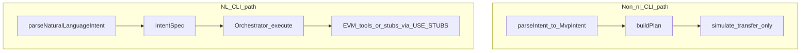

# CLI 双路径对齐（Phase 1）实现计划

> **For Claude:** REQUIRED SUB-SKILL: Use superpowers:executing-plans to implement this plan task-by-task.

**Goal:** 使仓库文档与 `apps/server/src/cli.ts` 真实行为一致，并为 JSON/样例路径的 `buildPlan` 行为加上 Vitest 契约测试，作为后续收敛 Orchestrator 与 MVP 模拟路径的基线。

**Architecture:** 不改 CLI 控制流，只做「事实来源对齐」：`--nl` / `--intent-nl` 分支调用 `Orchestrator.execute(IntentSpec)`（依赖 `packages/tools/src/evm/config.ts` 中 `LUCIDWALLET_USE_STUBS` / `NODE_ENV=test` 的 stub 行为）；非 NL 分支仍为 `parseIntent` → `buildPlan` → 仅 `simulate_transfer`。现有端到端参考测试：`apps/server/src/__tests__/nl_orchestrator.test.ts`。

**Tech Stack:** TypeScript monorepo、`npm run test`（Vitest）、Markdown 文档（`README.md` / `README_CN.md`）。

**执行记录（Phase 1）：**

- `test(server): lock buildPlan mock-path contract` — `apps/server/src/__tests__/build_plan.test.ts`
- `fix: extend dataset schema for samples.jsonl and add NL swap template` — 恢复缺失的 `datasets/nl/templates/send_swap.json`，并扩展 `packages/core` 数据集 schema（`approve` / `sign` task、`require_unlimited_approval`），使 `samples.jsonl` 与 NL 测试在 `npm run test` 下通过
- `docs: align README CLI flows with dual-path cli.ts behavior` — 中英文 README CLI 双路径与 `buildPlan` 单步描述

---

## 现状简述（mermaid）

---

### Task 1: 新增 `buildPlan` 契约测试

**Files:**

- `apps/server/src/__tests__/build_plan.test.ts`

（已实现 — 见 git 历史。）

---

### Task 2: 修正中英文 README 的 CLI 数据流描述

**Files:**

- `README.md`
- `README_CN.md`

（已实现。）

---

### Task 3: 将本计划落盘到 `docs/plans/`

（本文件。）

---

## Phase 2（后续 writing-plans，本阶段不实现）

- 可选：CLI 显式 `--engine mock|orchestrator`，或统一 JSON 意图走 `Orchestrator`（需 `MvpIntent` → `IntentSpec` 与 consent 设计）。
- 可选：`apps/server/src/http.ts` 与 CLI 行为对齐说明。

---

## 执行方式（交接）

1. **本会话逐步执行** — 每任务后复查；需要时使用 **superpowers:subagent-driven-development**。
2. **新会话批量执行** — 在独立 worktree 中打开本计划，使用 **superpowers:executing-plans** 按任务跑。
