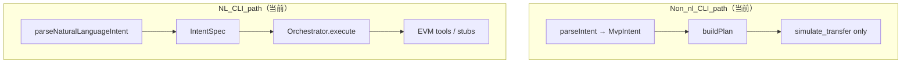
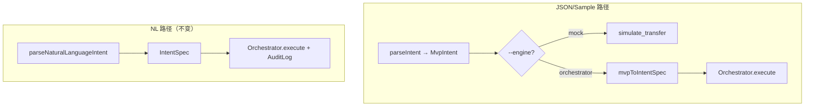

# Phase 2：引擎标志 + HTTP 测试 + AuditLog 集成

**日期:** 2026-03-22
**分支:** `claude/review-project-progress-RqBY9`

## 目标

基于 Phase 1（CLI 双路径对齐）的成果，Phase 2 完成三项工作：

1. **CLI `--engine` 标志** — 允许 JSON/样例路径也走 Orchestrator（统一两条路径）
2. **HTTP API 测试** — 为 `apps/server/src/http.ts` 补充端到端测试
3. **AuditLog 集成** — 将 Orchestrator 每步执行结果写入 AuditLog，并在返回值中暴露

---

## 现状（Phase 1 完成后）



---

## Phase 2 架构目标



---

## Task 1: CLI `--engine mock|orchestrator` 标志

**文件:** `apps/server/src/cli.ts`

**变更摘要:**
- 新增 `--engine` 参数，默认值 `mock`
- 当 `--engine orchestrator`：通过 `mvpToIntentSpec()` 将 `MvpIntent` 升级为 `IntentSpec`，然后走 `Orchestrator.execute()`

**MvpIntent → IntentSpec 映射:**
```typescript
{ action_type: intent.action, chain: intent.chain, asset_in: intent.asset,
  amount: intent.amount, recipient: intent.to }
```

**CLI 示例:**
```bash
node cli.js --sample-index 0 --engine orchestrator
node cli.js --intent '{"action":"send",...}' --engine mock
```

---

## Task 2: HTTP API 测试

**文件:**
- `apps/server/src/http.ts` — 导出 `handler` 函数（最小化变更）
- `apps/server/src/__tests__/http.test.ts` — 新增测试文件

**测试矩阵:**

| 场景 | 路由 | 期望状态码 | 期望响应字段 |
|------|------|-----------|------------|
| 有效 NL 输入 | `/api/plan` | 200 | `ok: true`, `data.plan` |
| 有效 NL 输入 | `/api/execute` | 200 | `ok: true`, `data.results` |
| 缺少 `text` 字段 | `/api/plan` | 400 | `ok: false`, `error.message: "missing_text"` |
| 空 body | `/api/execute` | 400 | `ok: false` |
| 未知路由 | `/api/unknown` | 404 | `ok: false` |
| OPTIONS 预检 | `/api/plan` | 204 | 无 body |

---

## Task 3: AuditLog 集成

**文件:**
- `apps/server/src/orchestrator.ts` — 在 `execute()` 中记录每步结果
- 返回值扩展为 `{ plan, results, auditLog: AuditEntry[] }`

**日志事件类型:**
- `step_start`：步骤开始前，记录 `step_id` 和 `tool`
- `step_success`：步骤成功，记录 `step_id` 和输出摘要
- `step_failed`：步骤失败，记录 `step_id` 和错误信息

---

## 执行记录

- [ ] `feat(cli): add --engine flag to JSON/sample path`
- [ ] `feat(http): export handler; add http.test.ts`
- [ ] `feat(orchestrator): integrate AuditLog into execute()`
